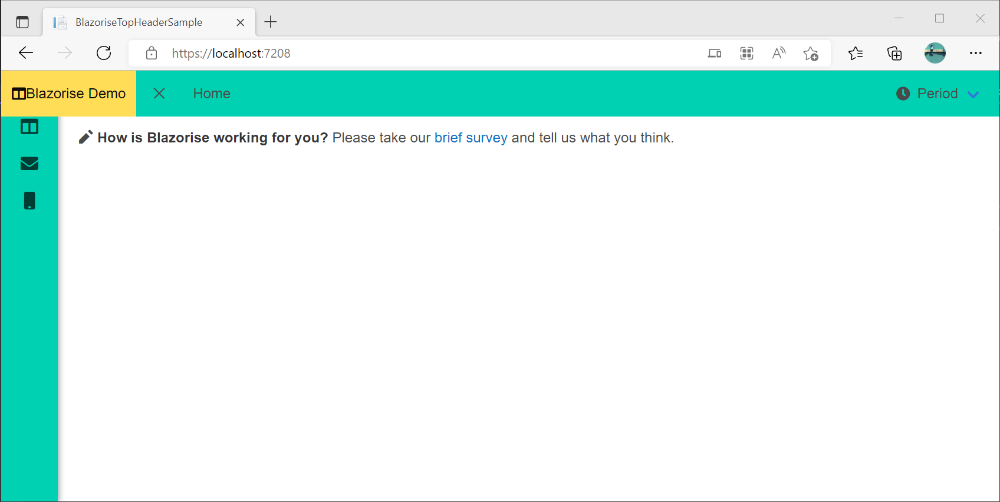

# BlazoriseTopHeaderSample

This is Blazorise Layout with Top Header

Theme is modified in App.razor to have BarOptions.HorizontalHeight = "52px"

There is weird behaviour that I see in this sample.

- Without change in theme Side Bar Menu shows hidden under top header
- With change in theme BarOptions.HorizontalHeight = "52px" Side Bar Menu shows as I wanted to
- BarIcon of Brand Component is sticked to title "Blazorise Demo"
- BarToggler shoud be modified with Display attribute otherwise is not visible on desktop

Side Menu Open - BarOptions.HorizontalHeight = "52px"

Side Menu Closed - BarOptions.HorizontalHeight = "52px"

Side Menu Open - without BarOptions.HorizontalHeight = "52px"

Side Menu Cloed - without BarOptions.HorizontalHeight = "52px"

